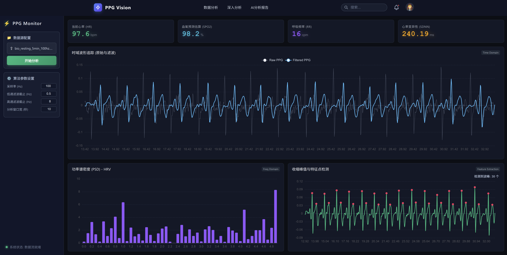

# PPG 智能脉搏波分析系统技术文档

## 1. 文档定位与使用方式

本技术文档面向**两个核心商业与技术场景**进行统一设计：

- **路演展示 (Pitch Deck)**：在有限篇幅内清晰传达产品价值、技术可行性与商业落地能力。
- **企划详述 (Business Plan)**：提供可核验的系统架构、算法路径、工程实现与风险控制依据。

基于此，本文采用**“先概览、后细化、再落地”**的结构，使本内容既可提炼为高管/投资人视角的信息，也可作为研发团队的架构级技术参考。

## 2. 项目目标与价值主张

本项目旨在构建一个**光电容积脉搏波（PPG）信号智能分析系统**，实现在标准 Web 环境中从数据接入到智能报告生成的全链路闭环。



**核心价值主张**：

- **全链路闭环**：覆盖数据接入、信号预处理、特征计算、多维可视化到大模型（LLM）驱动的智能报告生成。
- **高兼容与易用性**：支持 `.csv` 与 `.json` 多格式无缝接入，降低使用门槛。
- **双重业务形态**：兼具**“技术验证样机”**与**“商业产品原型”**双重属性，广泛适用于研发验证、医疗辅助评估、健康管理演示与产业合作沟通。

## 3. 总体技术架构

系统采用**前后端分离架构**，各层职责边界清晰，具备高迭代效率与平滑迁移容器化/分布式环境的能力。

- **前端交互层**：由 Vue 3、Vite 与 TypeScript 构建。负责文件上传、参数下发、实时图表渲染（时域/频域/峰值标定）及 AI 报告的流式呈现。
- **后端服务层**：由 FastAPI 承载计算与服务编排。负责信号解析、预处理阶段（滤波、基线漂移消除）、生理特征提取（HR、SpO2、HRV 等）。
- **智能引擎层**：基于本地大模型，将量化的生理特征转化为深度的健康解读自然语言报告。

## 4. 关键模块设计

### 4.1 前端工作台模块

前端围绕**单页数据工作台 (SPA)** 设计，提供一站式分析体验：


- **数据与参数面板**：支持数据源快速接入与算法参数动态实时调整。
- **多维信号视图**：
  - **时域对比图**：直观呈现原始波形与去噪/滤波后波形的差异。
  - **频域分析图**：展示信号的功率谱密度分布情况。
  - **峰值检测图**：对 PPG 波形的关键形态点（如收缩峰主波）进行精准识别与标定。

> _价值点_：使技术评审或医疗人员能快速判断信号质量与处理可信度，降低纯文本沟通理解成本。

### 4.2 后端分析与编排模块

后端采用经典的**三层架构**设计：

- **接口层 (API Layer)**：负责路由分发、接收数据文件及参数格式校验。
- **处理层 (Processing Layer)**：执行核心 DSP（数字信号处理）算法与生理特征量化计算。
- **智能服务层 (AI Service Layer)**：接收结构化特征结果，利用 Prompt 模板触发大语言模型，输出自然语言健康分析。

接口职责单一且命名语义明确，能够全面支持前端交互、自动化测试和第三方系统集成。

## 5. 数据流与处理流程

系统数据流转严格遵循“输入标准化 -> 特征提取 -> 智能解释 -> 渲染输出”的标准管线。


该流程的数学抽象映射关系如下：
设 $x(t)$ 表示原始输入信号，$\hat{x}(t)$ 表示处理后的净信号，$F$ 表示提取的特征向量，$R$ 表示最终生成的报告结果。

1. **预处理与特征提取**：

   $$
   F = \Phi(\hat{x}(t)) = \Phi(\Psi(x(t)))
   $$

   _式中，$\Psi(\cdot)$ 对应信号预处理算子（如滤波），$\Phi(\cdot)$ 对应生理特征提取算子。_

2. **智能解释生成**：
   $$
   R = \Gamma(F)
   $$
   _式中，$\Gamma(\cdot)$ 对应大语言模型（LLM）的语言生成算子。_

**架构层面的优势**：保证了每一层的松耦合与可替换性，便于后续引入更高精度的信号算法规则或更强大的领域模型。

## 6. 核心接口与实现示意

后端接口设计遵循**“功能与逻辑最小闭环”**原则。统一入口屏蔽了底层文件格式差异，使错误路径与成功路径同样可监控、追踪。

以下为系统核心分析接口的服务编排实现示意：

```python
from fastapi import UploadFile, File
import pandas as pd
import io

@app.post("/api/analyze")
async def analyze_ppg(file: UploadFile = File(...)):
    """接收上传的 PPG 数据文件并执行全面分析"""
    contents = await file.read()

    # 格式路由与数据解析
    if file.filename.endswith('.csv'):
        df = pd.read_csv(io.StringIO(contents.decode('utf-8')))
    elif file.filename.endswith('.json'):
        df = pd.read_json(io.BytesIO(contents))
    else:
        return {"error": "Unsupported file format. Please upload CSV or JSON."}

    # 提取首列有效数据并剔除空值 (NaN)
    raw_signal = df.iloc[:, 0].dropna().tolist()

    # 核心处理流水线 (默认 100Hz 采样处理缓冲信号)
    result = process_buffer(raw_signal, fs=100)

    return result
```

此设计在不增加前端复杂度的前提下实现了多格式兼容。对于路演场景而言，体现了高度的工程化完整度；对于企划书场景而言，则展现了系统的稳健性与可扩展性。

## 7. 智能分析能力与可解释性 (Explainable AI)

系统的AI能力**并非替代传统确定性信号算法**，而是建立在极其严谨的可量化特征之上的**语义增强辅助层**。


系统运行机制具有极强的 **可解释性 (Interpretability)**：

- **客观输入**：明确的生理指标对象值。
- **具象呈现**：可追溯至时域、频域波形的图表依据。
- **可信推论**：评审方可以通过 **“特征指标值 → 图表直观证据 → 文本结论解读”** 的链路进行深度交叉验证。

这一机制有效降低了仅凭“黑盒大模型”直接输出医学/健康结论带来的信任壁垒，大幅提升技术在路演及应用中的说服力。

## 8. 工程化部署与运行条件

系统天然契合现代云原生及私有化部署需求：

- **前端工具链**：Node 生态、Vue 3、Vite，极简化打包交付。
- **后端及算法服务库**：FastAPI 提供高性能异步网关，结合 Pandas / SciPy 等科学计算库。
- **模型推理私有化**：采用本地化大模型推理路径，在离线环境、医疗内网或弱网条件下依然能保持核心功能独立可用。

**部署策略优势**：兼顾了演示场景的高可用与低延迟，同时契合了商业化医疗应用中对**数据归属权、隐私安全（数据不出域）**的严苛合规要求。
